# Web-ларёк | documentation

## Примечание

Во избежание наслаивания сеттеров и геттеров в UML, было принято решение ввести дополнительную нотацию. Постфиксом после поля в фигурных скобках указывается, есть ли у поля сеттер и геттер. Может указываться отельно либо сеттер, либо геттер, либо оба, либо это поле в целом может отсутствовать.
Примеры:

- `+someField: someType - {S, G}`
- `+someField: someType - {S}`
- `+someField: someType`

## Используемый стек

- HTML
- TypeScript
- SCSS
- WebPack
- ESLint

## Структура проекта

- src/ — исходные файлы проекта
- src/components/ — папка с JS компонентами
- src/components/base/ — папка с базовым кодом

### Важные файлы

- src/pages/**index.html** — HTML-файл главной страницы
- src/types/**index.ts** — файл с типами
- src/**index.ts** — точка входа приложения
- src/scss/**styles.scss** — корневой файл стилей
- src/utils/**constants.ts** — файл с константами
- src/utils/**utils.ts** — файл с утилитами

## Установка и запуск

Для **установки** проекта необходимо выполнить команды:

```bash
npm install
```

Для **запуска проекта** в режиме разработки выполнить команду:

```bash
npm run start
```

**Сборка** проекта

```bash
npm run build
```

## Реализация

Данное приложение было реализовано с помощью архитектуры MVP:

- **Model** - модель данных;
- **View** - модель отображения интерфейса;
- **Presenter** - связующая модель;

# БАЗОВЫЙ КОД

## Класс "Api"

Отправляет и принимает данные с сервера.

constructor - приниамет базовый адрес и данные для запросов,
handleResponse - проверяет ответ сервера, может вернуть ошибку или данные
get - получает данные
post - отправляет данные

## Класс "EventEmitter"

Представляет из себя паттерн Observer. Обеспечивает работу событий.
Функции:

- установка и снятие слушателя событий;
- вызов слушателя при возникновении события;

```
"on"/"off" - Установить/Снять обработчик на событие,
"emit" - Инициировать событие с данными,
"onAll" - Слушать все события,
"offAll" - Сбросить все события,
"trigger" - Сделать коллбек триггер, генерирующий событие при вызове
```

## Класс "Component"

Абстрактный класс для работы с DOM

```
"toggleClass" - Переключить класс
"setText" - Установить текстовое содержимое
"setDisabled" - Сменить статус блокировки
"setHidden" - Скрыть
"setVisible" - Показать
"setImage" - Установить изображение с алтернативным текстом
"render" - Вернуть корневой DOM-элемент
```

## ОТОБРАЖЕНИЕ (Model):

## ОТОБРАЖЕНИЕ(View):

### Класс Page

Представляет класс для управления отображением элементов страницы веб-приложения.

### Поля класса `Page`

- `counter` - Элемент DOM счетчика количества товаров в корзине
- `catalog` - Элемент DOM для отображения каталога товаров.
- `wrapper` - Элемент DOM для обертки страницы.
- `basket` - Элемент DOM для корзины товаров.

### Класс Page

## Ключевые типы данных

### ICard

```ts
export interface ICard = {
id: string,
description?: string,
image: string,
title: string,
category: Category,
price: number
}
```

### IItemCatalogue

Описывает коллекцию каталога предметов, потображаемых на главной странцие

```ts
export interface ItemCatalogue {
	items: Set<IItem>;
	addItem: (item: IItem) => void;
	addItems: (items: IItem[]) => void;
	getItemByID: (id: IItem) => IItem;
	getItems: () => IItem[];
}
```

### IPayment

```ts
Описывает способ оплаты и адрес доставки
export interface IPayment {
paymentMethod: PaymentMethod
address: string
}
```

### IOrderForm

Описывает форму заказа данных о заказчике

```ts
export interface IOrderForm {
	email: string;
	phone: string;
}
```

### IOrderInfo

Описывает способ оплаты и позволяет ввести адрес доставки заказа. IPayment обеспечивает удобный способ представления и использования различных методов оплаты в приложении.

### FormErrors

Тип ошибки формы ввода

### IBasket

Тип для описания элемента корзины, содержащий информацию о товаре

```ts
export interface Basket {
	items: ICard[];
	addItem: (item: ICard) => void;
	removeItemById: (id: number) => void;
	clearBasket: () => void;
	getItemsNumber: () => number;
	getCost: () => number;
}
```

### IAppState

Тип данных, описывающий состояние приложения, включающий хранение карточек, выбранных товаров, предпросмотра, данных заказа и суммы заказа.

```ts
export interface IAppState {
	catalog: IItemCatalogue[];
	basket: IBasket;
	preview: string | null;
	order: IOrder | null;
	loading: boolean;
}
```

### IOrderResult

Описывает результат заказа с уникальным идентификатором и суммой.

## View

Каждый UI класс наследуется от `Component<T>` либо сам, либо от родителя. В качестве `Т` каждый класс принимает свой тип данных для рендера. Соответственно параллельно с каждым классом составляется интерфейс для данных рендера, который описывается радом.

### Component

Абстрактный класс, представляет базовый функционал для создания компонентов интерфейса

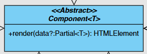

- `render` - используется для обновления данных компонента. Он принимает объект data с частичными данными и применяет их к текущему экземпляру компонента. Возвращает корневой DOM-элемент компонента

### Page

Контейнер для управления информацией в элементах топбара и коллекциии каталога

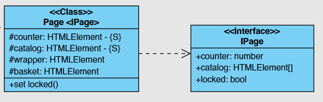

#### Page UI Class

- `counter` - элемент счетчика на кнопке корзины
- `catalog` - контейнер для элементов каталога
- `wrapper` - контейнер всей страницы. В данном случае используется для блокировки прокрутки при открытии модального окна
- `basket` - кнопка корзины

##### Методы:

- `set locked()` - выставляет состояние блокировки скролла

#### IPage Render interface

- `counter` - количество объектов в корзине, для выставления в счетчик
- `catalog` - отренедренные элементы класса `CatalogItem` по темплейту `cardCatalogTemplate`
- `locked` - определение состояния блокировки скролла

### ItemCard

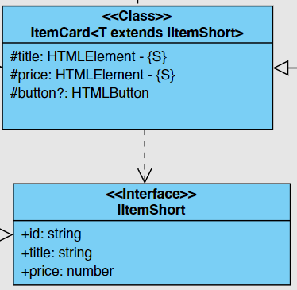

Базовый класс для компонент содержащий информацию о товаре  
Поскольку все классы, наследующие данный класс, должны иметь в рендере минимум те же поля, что в `IItemShort`, то тут стоит ограничитель по типу для `T`

#### ItemCard UI class

- `title` - контейнер заголовка карточки
- `price` - контейнер цены карточки
- `button` - кнопка карточки

#### ItemCard render interface

Идентичен модельному классу [IItemShort](#iitemshort)

### CatalogItem

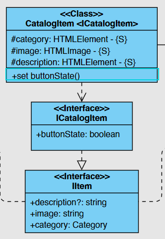

Отвечает за отображения двух типов карточек - превью и каталог. В зависимости от выбраного template элемента рендерит карточку catalog/preview

#### CatalogItem UI Class

- `category`- элемент категории товара
- `image`- элемент изображение товара
- `description`- элемент текстового описания товара

##### Методы:

- `set buttonState` - устанваливает состояние кнопки на карточку

#### ICatalogItem render interface

Расширяет модельный интерфейс [IItem](#iitem). Добавляется еще одно поле, использующееся при рендере - `buttonState`

- `buttonState` - состояние кнопки

### BasketCard

Карточка товара, находящаяся в корзине.

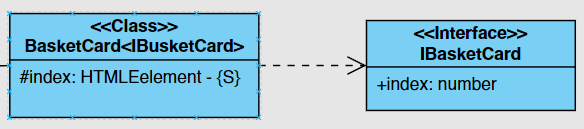

#### BasketCard UI Class

- `index` - элемент индекса товара

#### IBasketCard render interface

Расширяет модельный класс [IItemShort](#iitemshort) с добавлением поля индекса

- `index` - индекс товара

### Modal

Общий контейнер для всех модальных окон и вывода на них контента

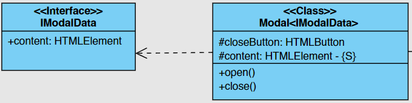

### Modal UI Class

- `closeButton` - элемент кнопки закрытия модального окна
- `content` - контейнер для контента
- `open()` - метод открытия модального окна
- `close()` - метод закрытия модального окна

#### IModalData render interface

- `content` - контент который подается для отображения в модальном окне

### Form

Отображает формы на странице и управляет отображением состояния форм.

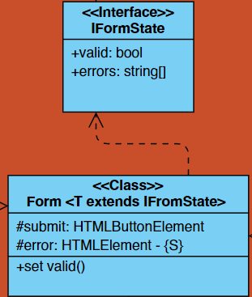

### Form UI Class

- `submit` - элемент конпки для подтверждения формы
- `error` - элемент вывода ошибки формы

##### Методы:

- `set valid` - выставляет значение валидности формы

#### IFormState render interface

Минимальный набор данных необходимый для рендера формы, которйы должен учитываться в наследуемых классах

- `valid` - состяние валидности
- `errors` - массив ошибок, который необходимо отрендерить

### Contact

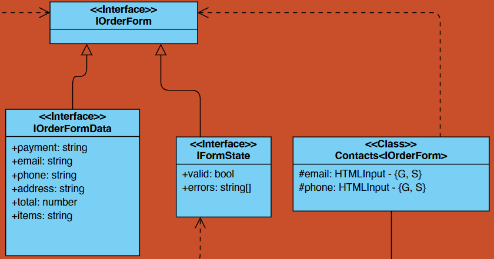

Класс для работы с формой ввода почты и телефона. Получает значения полей get-методами, чтобы разблокировать кнопку отправки формы

#### Contact UI Class

- `email` - инпут элемент для ввода электронной почты
- `phone` - инпут элемент для ввода телефонного номера

#### IOrderForm render interface

Расширяет модельный интерфейс [IOrderFormData](#iorderformdata) и базовый необходимый интерфейс [IFormState](#iformstate-render-interface)

### Payment

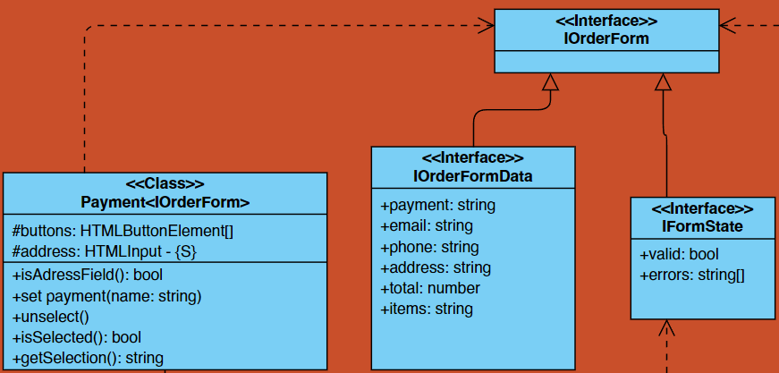

Предназначен для работы с формой "Способ оплаты". Он используется для управления элементами формы, связанными с выбором способа оплаты.

#### Payment UI Class

- `buttons` - массив кнопок, представляющих доступные способы оплаты
- `address` - элемент ввода для адреса доставки
- `isAddressField()` - проверяет, заполнено ли поле адреса
- `set payment(name)` - выставялет значение поля впособа оплаты
- `unselect()` - снимает выделение со способов оплаты
- `isSelected()` - проверка выбора способа опалты
- `getSelection()` - получить способ оплаты

#### render interface

Идентичен интерфейсу используемому в [Contact](#contact): [IOrderForm](#iorderform)

### Basket

Обеспечивает функциональность для управления отображением содержимого корзины в модальном окне, а также реагирование на пользовательские действия (Кажется это описание для модели)

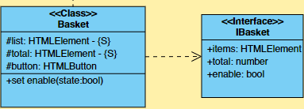

#### Basket UI Class

- `list` - элемент представляющий список товаров в корзине
- `total` - элемент представляющий общую сумму товаров в корзине
- `button` - элемент  представляющий кнопку корзины.
- `set enable` - метод для установки состояния кнопки корзины  

#### IBasket render interface

- `items` - массив отрендереных элемен7тов по классу [BasketCard](#basketcard)
- `total` - общая сумма заказа 
- `enable` - состояние кнопки 

### Success

Предназначен для отображения окна с уведомлением об успешном заказе

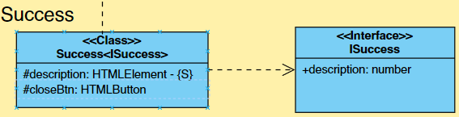

#### Success UI Class

- `description` - элемент представляющий описание успешного заказа
- `closeBtn` - элемент кнопки закрытия окна уведомления

#### ISuccess render interface

- `description` - описание успешного заказа


### Модельные интерфейсы

#### IItemShort

Минимальный набор данных объекта из каталога

- `id` - сохраняемый в элементе Id карточки
- `title` - элемент заголовка карточки
- `price` - элемент цены карточки

#### IItem

Расширяет [IItemShort](#iitemshort)

- `description` - описание товара
- `image` - ссылка на изображение, хранящееся в images
- `category` - категория товара типа [Category](#category)

### Category

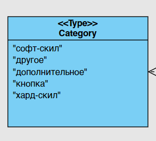

Категории товаров

## IOrderForm INTERCAFE

## Model

### Model

###
