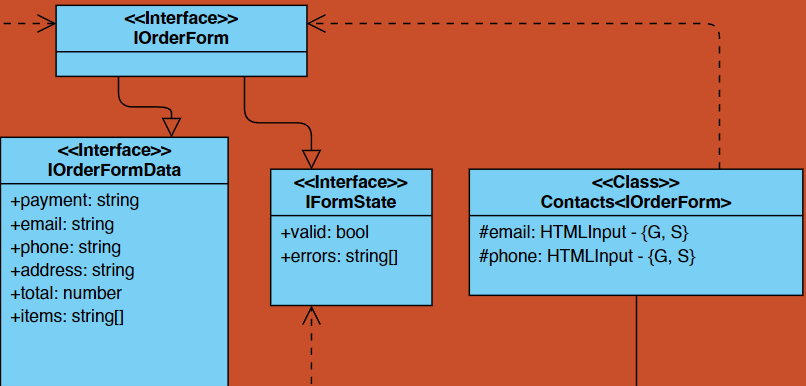

# Web-ларёк | documentation

## Примечание

Во избежание наслаивания сеттеров и геттеров в UML, было принято решение ввести дополнительную нотацию. Постфиксом после поля в фигурных скобках указывается, есть ли у поля сеттер и геттер. Может указываться отельно либо сеттер, либо геттер, либо оба, либо это поле в целом может отсутствовать.
Примеры:

- `+someField: someType - {S, G}`
- `+someField: someType - {S}`
- `+someField: someType`

## Используемый стек

- HTML
- TypeScript
- SCSS
- WebPack
- ESLint

## Структура проекта

- src/ — исходные файлы проекта
- src/components/ — папка с JS компонентами
- src/components/base/ — папка с базовым кодом

### Важные файлы

- src/pages/**index.html** — HTML-файл главной страницы
- src/types/**index.ts** — файл с типами
- src/**index.ts** — точка входа приложения
- src/scss/**styles.scss** — корневой файл стилей
- src/utils/**constants.ts** — файл с константами
- src/utils/**utils.ts** — файл с утилитами

## Установка и запуск

Для **установки** проекта необходимо выполнить команды:

```bash
npm install
```

Для **запуска проекта** в режиме разработки выполнить команду:

```bash
npm run start
```

**Сборка** проекта

```bash
npm run build
```

## UML-схема


## Реализация

## Об архитектуре

Взаимодействия внутри приложения происходят через события. Модели инициализируют события, слушатели событий в основном коде выполняют передачу данных компонентам отображения, а также вычислениями между этой передачей, и еще они меняют значения в моделях.

Данное приложение было реализовано с помощью архитектуры MVP:

- **Model** - модель данных;
- **View** - модель отображения интерфейса;
- **Presenter** - связующая модель;

## БАЗОВЫЙ КОД

### Class `Api`

Класс для работы с API. Отправляет и принимает данные с сервера


`constructor(baseUrl: string, options: RequestInit = {})` - принимает url и опции запроса

Свойства:

- `baseUrl` - принимает базовый URL
- `options`- данные для запросов

Методы:

- `handleResponse` - проверяет ответ сервера, может вернуть ошибку или данные
- `get` - получает данные
- `post` - отправляет данные

### Class `ShopAPI`


Предоставляет методы для взаимодействия с внешним апи. Наследуется от `Api`

`constructor(cdn: string, baseUrl: string, options?: RequestInit)` - создает новый экземпляр ShopAPI с CDN, URL и опциями

Свойства:

- `cdn` - CDN

Методы:

- `getProductItem()` - получить данные товара
- `getProductList()` - получить данные каталога
- `orderProduct()` - отправить данные заказа

### Class `EventEmitter`

Представляет из себя паттерн Observer. Обеспечивает работу событий. Позволяет установить и снять слушатели событий, а также вызывать слушатели при возникновении события


Свойства:

- `events` - хранит типы событий и их обработчики

Методы:

- `on()` - установить/Снять обработчик на событие
- `off()` - снять обработчик на событие
- `emit()` - инициировать событие с данными
- `onAll()` - слушать все события
- `offAll()` - сбросить все события
- `trigger()` - сделать коллбек триггер, генерирующий событие при вызове


## View

Каждый UI класс наследуется от `Component<T>` либо сам, либо от родителя. В качестве `Т` каждый класс принимает свой тип данных для рендера. Соответственно параллельно с каждым классом составляется интерфейс для данных рендера, который описывается радом.

### Class `Component<T>`


Абстрактный базовый класс, предназначенным для создания компонентов пользовательского интерфейса. Класс обеспечивает инструментарий для управления DOM элементами и поведением компонента. Наследуется всеми классами представления(View)

`constructor(container: HTMLElement)` - принимает элемент контейнера, в который будет помещен компонент

Методы:

- `toggleClass` - переключается класс для переданного элемента.
- `setText` - устанавливает текстовое содержимое для переданного элемента.
- `setImage` - устанавливает изображения и альтернативный текст для изоображения(опционально) для переданного элемента типа HTMLImageElement
- `setDisabled` - изменяет статус блокировки для переданного элемента
- `setHidden`, `setVisible` - скрывает,отоброжает переданный элемент
- `render` - рендерит компонент, используя переданные данные. Метод должен быть переназначен в дочерних классах

### Class `Page`


Класс Page представляет собой компонент пользовательского интерфейса, который управляет отображением страницы. Он наследует функциональность базового класса `Component<IPage>`

`constructor(container: HTMLElement, events: IEvents)` - принимает два параметра: container, который представляет собой элемент контейнера, в который будет помещен компонент, и events, который представляет собой интерфейс для управления событиями в приложении

#### Page UI Class

Свойства: 

- `counter` - элемент счетчика на кнопке корзины
- `catalog` - контейнер для элементов каталога
- `wrapper` - контейнер всей страницы. В данном случае используется для блокировки прокрутки при открытии модального окна
- `basket` - кнопка корзины

Методы:

- `set counter(value: number)`: Устанавливает значение элемента счетчика
- `set catalog(items: HTMLElement[])`: Обновляет раздел каталога страницы с предоставленными товарами
- `set locked(value: boolean)` - выставляет состояние блокировки скролла

#### IPage render interface

- `counter` - количество объектов в корзине, для выставления в счетчик
- `catalog` - отренедренные элементы класса `CatalogItem` по темплейту `cardCatalogTemplate`
- `locked` - определение состояния блокировки скролла

### Class `ItemCard<T extends IItemCard>`


Базовый класс для компонент содержащий информацию о товаре. Наследует функциональность базового класса `Component<T extends IItemCard>`
Поскольку все классы, наследующие данный класс, должны иметь в рендере минимум те же поля, что в `IItemShort`, то тут стоит ограничитель по типу для `T`

`constructor(blockName: string, container: HTMLElement, events: IEvents)`  - принимает три параметра:  blockName, имя, по которому будет тянуться элемент,  container - передается в родительский конструктор, events - параметр объекта событий

Свойства:  

- `title` - контейнер заголовка карточки
- `price` - контейнер цены карточки
- `button` - кнопка карточки

Методы: 

- `set id()` - выставялет id элемента
- `set title()` - выставялет название 
- `set price()` - выставялет цену  

#### ItemCard render interface

Идентичен модельному классу [IItemShort](#iitemshort)

### Class `CatalogItem`


Отвечает за отображения двух типов карточек - превью и каталог. В зависимости от выбраного template элемента рендерит карточку catalog/preview.  Наследуется от `ItemCard<ICatalogItem>`

#### CatalogItem UI Class

`constructor(blockName: string, container: HTMLElement, events: IEvents)` - не отличается от родительского конструктора 

[ItemCard](#itemcard-render-interface)

Свойства: 

- `category`- элемент категории товара
- `image`- элемент изображение товара
- `description`- элемент текстового описания товара

Методы:

- `set buttonState()` - устанваливает состояние кнопки на карточку
- `set category()` - выставляет категорию товара 
- `set image()` -	устанваливает  изображение товара 
- `set description` - устанваливает описание товара 

#### ICatalogItem render interface

Расширяет базовый тип [IItem](#iitem). Добавляется еще одно поле, использующееся при рендере - `buttonState`

- `buttonState` - состояние кнопки

### Class `BasketCard`

Карточка товара, находящаяся в корзине. Наследуется от `ItemCard<IBasketCard>`

`constructor(blockName: string, container: HTMLElement, events: IEvents)`


#### BasketCard UI Class

- `index` - элемент индекса товара

#### IBasketCard render interface

Расширяет базовый тип [IItemShort](#iitemshort) с добавлением поля индекса

- `index` - индекс товара

### Class `Modal`

Общий контейнер для всех модальных окон и вывода на них контента


### Modal UI Class

- `closeButton` - элемент кнопки закрытия модального окна
- `content` - контейнер для контента
- `open()` - метод открытия модального окна
- `close()` - метод закрытия модального окна

#### IModalData render interface

- `content` - контент который подается для отображения в модальном окне

### Class `Form <T extends IFormState>`

Отображает формы на странице и управляет отображением состояния форм.


#### Form UI Class

- `submit` - элемент конпки для подтверждения формы
- `error` - элемент вывода ошибки формы
- `set valid()` - выставляет значение валидности формы

#### IFormState render interface

Минимальный набор данных необходимый для рендера формы, которйы должен учитываться в наследуемых классах

- `valid` - состяние валидности
- `errors` - массив ошибок, который необходимо отрендерить

### Class `Contact`



Класс для работы с формой ввода почты и телефона. Получает значения полей get-методами, чтобы разблокировать кнопку отправки формы

#### Contact UI Class

- `email` - инпут элемент для ввода электронной почты
- `phone` - инпут элемент для ввода телефонного номера

#### IOrderForm render interface

Расширяет базовый тип [IOrderFormData](#iorderformdata) и базовый необходимый интерфейс [IFormState](#iformstate-render-interface)

### Класс `Payment`


Предназначен для работы с формой "Способ оплаты". Он используется для управления элементами формы, связанными с выбором способа оплаты.

#### Payment UI Class

- `buttons` - массив кнопок, представляющих доступные способы оплаты
- `address` - элемент ввода для адреса доставки
- `isAddressField()` - проверяет, заполнено ли поле адреса
- `set payment(name)` - выставялет значение поля впособа оплаты
- `unselect()` - снимает выделение со способов оплаты
- `isSelected()` - проверка выбора способа опалты
- `getSelection()` - получить способ оплаты

#### render interface

Идентичен интерфейсу используемому в [Contact](#contact): [IOrderForm](#iorderform)

### Класс `Basket`

Обеспечивает функциональность для управления отображением содержимого корзины в модальном окне, а также реагирование на пользовательские действия (Кажется это описание для модели)


#### Basket UI Class

- `list` - элемент представляющий список товаров в корзине
- `total` - элемент представляющий общую сумму товаров в корзине
- `button` - элемент представляющий кнопку корзины.
- `set enable` - метод для установки состояния кнопки корзины

#### IBasket render interface

- `items` - массив отрендереных элементов по классу [BasketCard](#basketcard)
- `total` - общая сумма заказа
- `enable` - состояние кнопки

### Класс `Success`

Предназначен для отображения окна с уведомлением об успешном заказе


#### Success UI Class

- `description` - элемент представляющий описание успешного заказа
- `closeBtn` - элемент кнопки закрытия окна уведомления

#### ISuccess render interface

- `description` - описание успешного заказа

## Model layer

### Abstract Class `Model`

Абстрактный класс, служит базовым для всех моделей


- `emitChanges()` - используется для оповещения об изменениях в модели. Он принимает имя события event и необязательный параметр payload, который содержит дополнительные данные для передачи в событие

### Class `AppState`


Создается единожды содержит все модели данных

- `catalogue` - модель каталога товаров
- `basket` - модель корзины заказов
- `form` - модель формы заказа

### Class `BasketModel`

Модель данных корзины


- `items` - массив товаров в корзине
- `addItem()` - добавить товар в корзину
- `removeItemById()` - удалить товар из корзины по id
- `clearBasket()` - очищает корзину товаров
- `getCost()` - вычисляет общую стоимость товаров в заказе

### Class `ItemCatalogueModel`

Модель данных товара


- `items` - коллекция уникальных (множество) товаров на странцие
- `addItem()` - добавить товар в каталог
- `addItems()` - добавить товары в каталог
- `getItemById()` - получить товар по id
- `getItems()` - получить все товары

### Class `OrderFormModel`

Модель данных заказа


- `softValidate()` - запускается для проверки доступности нажатия кнопки next
- `hardValidate()` - запускается для проверки на ошибки формы после нажатия кнопки next

## Ключевые типы данных

### IItemShort

Минимальный набор данных объекта из каталога

```ts
export interface IItemShort {
	id: string; // - сохраняемый в элементе Id карточки
	title: string; // - элемент заголовка карточки
	price: number; // - элемент цены карточки
}
```

### IItem

Расширяет [IItemShort](#iitemshort), приходит с бэкенда

```ts
export interface IItem extends IItemShort {
	description?: string; // - описание товара
	image: string; // - ссылка на изображение, хранящееся в images
	category: Category; // - категория товара типа Category
}
```

### Category

```ts
export type Category =
	| 'софт-скил'
	| 'другое'
	| 'дополнительное'
	| 'кнопка'
	| 'хард-скил';
```

### IOrderFormData

Данные о заказе, отправляются на бэкенд

```ts
export interface IOrderFormData {
	payment: string; // - данные об оплате
	address: string; // - данные адреса покупателя
	email: string; // - данные эмеила покупателя
	phone: string; // -  данные телефонного номера покупателя
	items: string[]; // массив id товаров из корзины
	total: number; // данные общей стоимости заказа
}
```

### IOrderResult

Результаты о формировании заказа, приходят с бэкенда

```ts
export interface IOrderResult {
	id: string; // id заказа
	total: number; // - данные общей стоимости заказа
}
```

