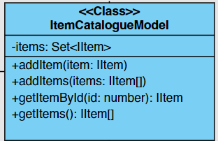

# Web-ларёк | documentation

## Примечание

## Используемый стек

- HTML
- TypeScript
- SCSS
- WebPack
- ESLint

## Структура проекта

- src/ — исходные файлы проекта
- src/components/ — папка с JS компонентами
- src/components/base/ — папка с базовым кодом

### Важные файлы

- src/pages/**index.html** — HTML-файл главной страницы
- src/types/**index.ts** — файл с типами
- src/**index.ts** — точка входа приложения
- src/scss/**styles.scss** — корневой файл стилей
- src/utils/**constants.ts** — файл с константами
- src/utils/**utils.ts** — файл с утилитами

## Установка и запуск

Для **установки** проекта необходимо выполнить команды:

```bash
npm install
```

Для **запуска проекта** в режиме разработки выполнить команду:

```bash
npm run start
```

**Сборка** проекта

```bash
npm run build
```

## UML-схема


## Реализация

## Об архитектуре

Взаимодействия внутри приложения происходят через события. Модели инициализируют события, слушатели событий в основном коде выполняют передачу данных компонентам отображения, а также вычислениями между этой передачей, и еще они меняют значения в моделях.

Данное приложение было реализовано с помощью архитектуры MVP:

- **Model** - модель данных;
- **View** - модель отображения интерфейса;
- **Presenter** - связующая модель;

## БАЗОВЫЙ КОД

### Class `Api`

Класс для работы с API. Отправляет и принимает данные с сервера


`constructor(baseUrl: string, options: RequestInit = {})` - принимает URL и опции запроса

Свойства:

- `baseUrl` - принимает базовый URL
- `options`- данные для запросов

Методы:

- `handleResponse(response: Response)` - представляет ответ от сервера, может вернуть ошибку или данные
- `get(uri: string)` - выполняет get-запрос к api
- `post(uri: string, data: object, method: ApiPostMethods = 'POST')` - выполняет post-запрос к api

### Class `ShopAPI`


Класс ShopAPI предоставляет методы для взаимодействия с API магазина. Наследуется от `Api`

`constructor(cdn: string, baseUrl: string, options?: RequestInit)` - принимает CDN, URL и опциями

Свойства:

- `cdn` - свойство только для чтения, содержащее базовый URL для CDN.

Методы:

- `getProductItem(id: string): Promise<IItem>` - получает данные товарара по id
- `getProductList(): Promise<IItem[]>` - получает данные каталога
- `orderProducts(order: IOrderFormData): Promise<IOrderResult>` - отправить данные заказа

### Class `EventEmitter`

Представляет собой брокер событий . Обеспечивает работу событий. Позволяет установить и снять слушатели событий, а также вызывать слушатели при возникновении события


Свойства:

- `events` - хранит типы событий и их обработчики

Методы:

- `on<T extends object>(eventName: EventName, callback: (event: T) => void)` - установить/Снять обработчик на событие
- `off(eventName: EventName, callback: Subscriber)` - снять обработчик на событие
- `emit<T extends object>(eventName: string, data?: T)` - инициировать событие с данными
- `onAll(callback: (event: EmitterEvent) => void)` - слушать все события
- `offAll()` - сбросить обработчики для всех событий
- `trigger<T extends object>(eventName: string, context?: Partial<T>)` - сделать коллбек триггер, генерирующий событие при вызове

## View

Каждый UI класс наследуется от `Component<T>` либо сам, либо от родителя. В качестве `Т` каждый класс принимает свой тип данных для рендера. Соответственно параллельно с каждым классом составляется интерфейс для данных рендера, который описывается радом.

### Class `Component<T>`


Абстрактный базовый класс, предназначенным для создания компонентов пользовательского интерфейса. Класс обеспечивает инструментарий для управления DOM элементами и поведением компонента. Наследуется всеми классами представления(View)

`constructor(container: HTMLElement)` - принимает элемент контейнера, в который будет помещен компонент

Методы:

- `toggleClass(element: HTMLElement, className: string, force?: boolean)` - переключается класс для переданного элемента
- `setText(element: HTMLElement, value: unknown)` - устанавливает текстовое содержимое для переданного элемента.
- `setImage(element: HTMLElement, state: boolean)` - устанавливает изображения и альтернативный текст для изоображения(опционально) для переданного элемента типа HTMLImageElement
- `setDisabled(element: HTMLElement, state: boolean)` - изменяет статус блокировки для переданного элемента
- `setHidden(element: HTMLElement)` - скрывает переданный элемент
- `setVisible(element: HTMLElement)` - отображает переданный элемент
- `render(data?: Partial<T>): HTMLElement` - рендерит компонент, используя переданные данные. Метод должен быть переназначен в дочерних классах

### Class `Page`


Класс Page представляет собой компонент пользовательского интерфейса, который управляет отображением страницы. Он наследует функциональность базового класса `Component<IPage>`

#### Page UI Class

`constructor(container: HTMLElement, events: IEvents)` - принимает два параметра: container, который представляет собой элемент контейнера, в который будет помещен компонент, и events, который представляет собой интерфейс для управления событиями в приложении

Свойства:

- `counter` - элемент счетчика на кнопке корзины
- `catalog` - контейнер для элементов каталога
- `wrapper` - контейнер всей страницы. В данном случае используется для блокировки прокрутки при открытии модального окна
- `basket` - кнопка корзины

Методы:

- `set counter(value: number)`: Устанавливает значение элемента счетчика
- `set catalog(items: HTMLElement[])`: Обновляет раздел каталога страницы с предоставленными товарами
- `set locked(value: boolean)` - выставляет состояние блокировки скролла

#### IPage render interface

- `counter` - количество объектов в корзине, для выставления в счетчик
- `catalog` - отренедренные элементы класса `CatalogItem` по темплейту `cardCatalogTemplate`
- `locked` - определение состояния блокировки скролла

### Class `ItemCard<T extends IItemCard>`


Базовый класс для компонент, предоставляющий методы для установки заголовка, цены и id продукта Наследует функциональность базового класса `Component<T extends IItemCard>`
Поскольку все классы, наследующие данный класс, должны иметь в рендере минимум те же поля, что в `IItemShort`, то тут стоит ограничитель по типу для `T`

#### ItemCard UI Class

`constructor(container: HTMLElement)` - принимает элемент контейнера, в который будет помещен компонент

Свойства:

- `title` - контейнер заголовка карточки
- `price` - контейнер цены карточки
- `button` - кнопка карточки

Методы:

- `set id()` - выставялет id элемента
- `set title()` - выставялет название
- `set price()` - выставялет цену

#### ItemCard render interface

Идентичен модельному классу [IItemShort](#iitemshort)

### Class `CatalogItem`


Отвечает за отображения двух типов карточек - превью и каталог. В зависимости от выбраного template элемента рендерит карточку catalog/preview. Наследуется от `ItemCard<ICatalogItem>`

`constructor(container: HTMLElement, events: IEvents)` - принимает два параметра: элемент контейнера, в который будет помещен компонент и events, который представляет собой интерфейс для управления событиями в приложении

#### CatalogItem UI Class

[ItemCard](#itemcard-render-interface)

Свойства:

- `category`- элемент категории товара
- `image`- элемент изображение товара
- `description`- элемент текстового описания товара

Статические свойства:

- `remapCategory2Class` - сопоставляет категорию товара с классом CSS

Методы:

- `set buttonState(val: boolean)` - устанваливает состояние кнопки на карточку
- `set category(value: Category)` - выставляет категорию товара
- `set image(value: string)` - устанваливает изображение товара
- `set description(value: string)` - устанваливает описание товара

#### ICatalogItem render interface

Расширяет базовый тип [IItem](#iitem). Добавляется еще одно поле, использующееся при рендере - `buttonState`

- `buttonState` - состояние кнопки

### Class `BasketCard`

Карточка товара, находящаяся в корзине. Наследуется от `ItemCard<IBasketCard>`


#### BasketCard UI Class

`constructor(container: HTMLElement, events: IEvents)` - принимает два параметра: элемент контейнера, в который будет помещен компонент и events, который представляет собой интерфейс для управления событиями в приложении \\

Свойства:

- `index` - элемент отображающий индекс товара в корзине

Методы:

- `set index(value: number)` - устанавливает индекс товара в корзине

#### IBasketCard render interface

Расширяет базовый тип [IItemShort](#iitemshort) с добавлением поля индекса

- `index` - индекс товара отображающий индекс продукта в корзине

### Class `Modal`


Общий контейнер для всех модальных окон и вывода на них контента. Также управляет его отображением и скрытием. Наследуется от `Component<IModalData>`.

### Modal UI Class

`constructor(container: HTMLElement, events: IEvents)` - принимает два параметра: элемент контейнера, в который будет помещен компонент и events, который представляет собой интерфейс для управления событиями в приложении

Свойства:

- `closeButton` - элемент кнопки закрытия модального окна
- `content` - контейнер для содержимого модального окна

Методы:

- `set content(value: HTMLElement)` - установить контент для модального окна
- `open()` - метод открытия модального окна
- `close()` - метод закрытия модального окна
- `get isOpened()` - проверяет, открыто ли модальное окно

#### IModalData render interface

- `content` - контент который подается для отображения в модальном окне

### Class `Form <T extends IFormState>`

Отображает формы на странице и управляет отображением состояния форм. Наследуется от `Component<T extends IFormState>`.


#### Form UI Class

`constructor(container: HTMLElement, events: IEvents)` - принимает два параметра: элемент контейнера, в который будет помещен компонент и events, который представляет собой интерфейс для управления событиями в приложении

Свойства:

- `containerName` - имя контейнера формы
- `submit` - элемент кнопки для подтверждения формы
- `error` - элемент вывода ошибки формы

Методы:

- `set error(value: boolean)` - устанавливает ошибки валидации формы
- `set valid(value: string)` - выставляет значение валидности формы
- `clear()` - сбрасывает состояние формы

#### IFormState render interface

Минимальный набор данных необходимый для рендера формы, который должен учитываться в наследуемых классах

- `valid` - состяние валидности
- `errors` - массив ошибок, который необходимо отрендерить

### Class `Contact`


Класс для работы с формой ввода почты и телефона. Расширяет функциональность от класса `Form<IOrderForm>`

#### Contact UI Class

`constructor(container: HTMLElement, events: IEvents)` - container представляющий форму контактных данных и events для управления событиями

Свойства:

- `email` - инпут элемент для ввода электронной почты
- `phone` - инпут элемент для ввода телефонного номера

Методы:

- `set email(value: string)` - устанавливает значение email в инпуте
- `set phone(value: string)` - устанавливает значение phone в инпуте
- `clear(): void` - сбрасывает состояние формы, очищает поля

#### IOrderForm render interface

Расширяется от базового необходимого интерфейса [IFormState](#iformstate-render-interface) и общими данными формы [IOrderFormData](#iorderformdata)

### Класс `Payment`


Предназначен для работы с формой "Способ оплаты". Он используется для управления элементами формы, связанными с выбором способа оплаты. Расширяет функциональность от класса `Form<IOrderForm>`

#### Payment UI Class

`constructor(container: HTMLElement, events: IEvents)` - container представляет форму оплаты и events для управления событиями

Свойства

- `buttons` - массив кнопок, представляющих доступные способы оплаты
- `address` - элемент ввода для адреса доставки

Методы:

- `selectPayment(name: string): void` - выставялет значение поля cпособа оплаты
- `unselectPayment(): void` - снимает выделение со способов оплаты
- `set payment(name: string)` - выставялет значение поля cпособа оплаты
- `set address(value: string)` - выставялет значение поля ввода адреса
- `clear(): void` - сбрасывает состояние формы оплаты и очищает поля ввода

#### render interface

Идентичен интерфейсу используемому в [Contact](#contact): [IOrderFormData](#iorderform)

### Класс `Basket`

Обеспечивает функциональность для управления отображением содержимого корзины в модальном окне, а также реагирование на пользовательские действия. Расширяет функциональность от класса `Component<IBasket>`


#### Basket UI Class

`constructor(container: HTMLElement, protected events: IEvents)` - container в который будет встроен компонент корзины и events для управления событиями

Свойства:

- `items` - элемент представляющий список товаров в корзине
- `total` - элемент представляющий общую сумму товаров в корзине
- `button` - элемент представляющий кнопку корзины.

Методы:

- `set items(items: HTMLElement[])` - массив отрендереных элементов по классу [BasketCard](#basketcard)
- `set total(value: number)l` - общая сумма заказа
- `set enable` - состояние доступности кнопки

#### IBasket render interface

- `items` - список элементов продуктов в корзине
- `total` - общая стоимость продуктов в корзине
- `enable` - доступность кнопки для заказа

### Класс `Success`

Предназначен для отображения окна с уведомлением об успешном заказе. Расширяет функциональность от класса `Component<ISuccess>`


#### Success UI Class

`constructor(container: HTMLElement, protected events: IEvents)` - принимает два параметра: элемент контейнера, в который будет помещен компонент и events который представляет собой интерфейс для управления событиями

Свойства:

- `_description` - элемент для отображения описания успешного оформления заказа
- `closeBtn` - элемент кнопки закрытия окна уведомления

Методы:

- `set description(value: number)` - устанавливает описание успешного заказа
- `clear(): void` - очищает содержимое компонента, скрывая сообщение об успешном оформлении заказа

#### ISuccess render interface

- `description` - количество "синапсов", списанных со счета

## Model layer

### Abstract Class `Model`

Абстрактный класс, служит базовым для всех моделей


- `emitChanges(event: string, payload?: object)` - используется для оповещения об изменениях в модели. Он принимает имя события event и необязательный параметр payload, который содержит дополнительные данные для передачи в событие

### Class `AppState`


Класс, представляющий состояние приложения, включая данные каталога, предпросмотра, корзины, заказа и ошибок формы. В конструкторе класса создаются экземпляры моделей для каталога, корзины и формы заказа

- `catalog: IItemCatalogueModel` - модель каталога товаров
- `basket: IBasketModel` - модель корзины заказов
- `order: IOrderFormModel` - модель формы заказа

### Class `BasketModel`

Модель корзины товаров, которая управляет товарами в корзине и предоставляет методы для их добавления, удаления и очистки. Наследуется от `Model<IBasketModel>`


Свойства:

- `items` - массив товаров в корзине

Методы:

- `addItem(item: IItem): void` - добавляет товар в корзину и уведомляет об изменении
- `removeItemById(id: string): void` - удалить товар из корзины по id и уведомляет об изменении
- `clearBasket(): void` - очищает корзину товаров и уведомляет об изменении
- `getCost(): number` - возвращает общую стоимость товаров в заказе
- `getItemsNumber(): number` - получает кол-во товара в корзине
- `getItemByID(id: string): IItem | undefined` - получить предмет по его id, если он есть
- `getItems(): IItem[]` - получить массив предметов в корзине
- `getItemsId(): string[]` - полчить маассив id всех товаров в корзине
- `emitBasketChange()` - оповещает об изменениях в корзине, передавая новые товары

### Class `ItemCatalogueModel`

Модель каталога товаров, которая управляет товарами в каталоге и предоставляет методы для их добавления и получения. Наследуется от `Model<IItem>` имплементирует `IItemCatalogueModel`

`constructor(events: IEvents)`: принимает events который представляет собой интерфейс для управления событиями



Свойства:

- `items` - множество уникальных товаров в каталоге

Методы:

- `addItems(items: IItem[]): void` - добавяет массив товаров в каталог и уведомляет об изменении
- `getItemByID(id: string): IItem | undefined` - получает товар по id, если он есть
- `getItems(): IItem[]` - получить массив товаров в каталоге
- `emitCatalogChange()` - оповещает об изменениях в каталоге, передавая новые товары

### Class `OrderFormModel`

Модель формы заказа, которая управляет данными формы и выполняет их валидацию. Наследуется от `Model<IOrderFormData>` имплементирует `IOrderFormModel`


Свойства:

- `phone` - номер телефона
- `address` - адрес
- `email` - email
- `payment` - способ оплаты
- `items: string[]` - массив id покупаемых товаров
- `total: number` - сумма заказа

  Методы:

- `softValidate()` - запускается для проверки доступности нажатия кнопки next
- `hardValidate(type: FormType): boolean` - запускается для проверки на ошибки формы после нажатия кнопки next
- `getFormData(): IOrderFormData`- возвращает данные формы заказа
- `setFormField(data:{field: keyof IFormData, value: string}): IOrderFormModel` - устанавливает значение поля на основе данных
- `clearOrder(): void` - очищает данные заказа

## Ключевые типы данных

### IItemShort

Минимальный набор данных объекта из каталога

```ts
export interface IItemShort {
	id: string; // - сохраняемый в элементе Id карточки
	title: string; // - элемент заголовка карточки
	price: number; // - элемент цены карточки
}
```

### IItem

Расширяет [IItemShort](#iitemshort), приходит с бэкенда

```ts
export interface IItem extends IItemShort {
	description?: string; // - описание товара
	image: string; // - ссылка на изображение, хранящееся в images
	category: Category; // - категория товара типа Category
}
```

### Category

```ts
export type Category =
	| 'софт-скил'
	| 'другое'
	| 'дополнительное'
	| 'кнопка'
	| 'хард-скил';
```

### IOrderFormData

Данные о заказе, отправляются на бэкенд

```ts
export interface IOrderFormData {
	payment: string; // - данные об оплате
	address: string; // - данные адреса покупателя
	email: string; // - данные эмеила покупателя
	phone: string; // -  данные телефонного номера покупателя
	items: string[]; // массив id товаров из корзины
	total: number; // данные общей стоимости заказа
}
```

### IOrderResult

Результаты о формировании заказа, приходят с бэкенда

```ts
export interface IOrderResult {
	id: string; // id заказа
	total: number; // - данные общей стоимости заказа
}
```
